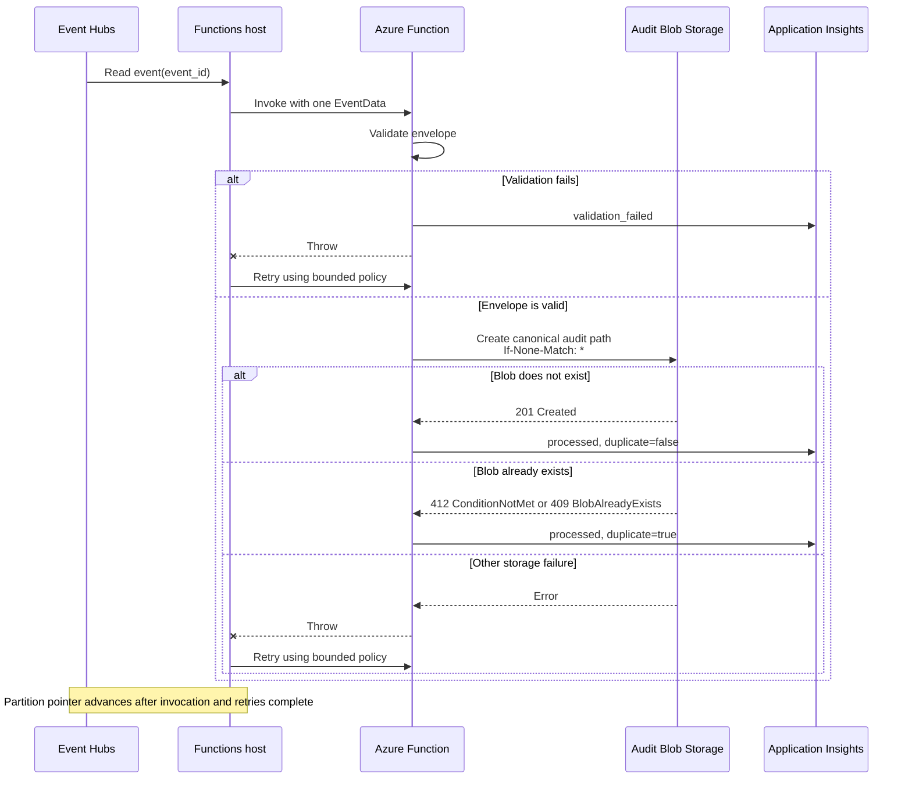
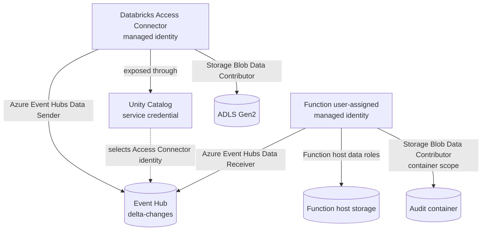
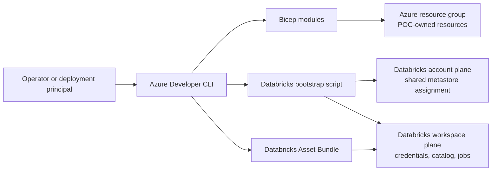

# Azure Delta Change Notification POC Architecture

## Purpose

This architecture proves that inserting or updating a row in an Azure Databricks Delta table produces a changed-row event that is received and durably captured by an Azure Function.

The design implements the Event Hubs pattern recommended in [research/research.md](research/research.md) and the decisions recorded in [plan.md](plan.md):

```text
Delta Change Data Feed -> Structured Streaming -> Event Hubs -> Azure Function
```

The POC is isolated within its own Azure resources except for an existing regional Unity Catalog metastore, which is an Azure Databricks account-level prerequisite.

## Architecture Goals

- Detect Delta inserts and updates without polling from the receiver.
- Carry the complete changed row in a stable JSON event envelope.
- Preserve per-row ordering by partitioning Event Hubs messages on `signal_id`.
- Authenticate service-to-service communication with Microsoft Entra identities.
- Produce durable, independently verifiable evidence in Blob Storage and Application Insights.
- Handle Event Hubs at-least-once delivery without creating duplicate audit records.
- Deploy and remove the POC repeatably with `azd`, Bicep, and Databricks Asset Bundles.

## Logical Architecture

```mermaid
flowchart LR
    Driver[Databricks change-driver job]

    subgraph Data[Data and Change Capture]
        Delta[Delta table<br/>poc_notifications.main.vehicle_signals]
        CDF[Delta Change Data Feed]
        Checkpoint[(ADLS Gen2<br/>stream checkpoint)]
    end

    subgraph Publisher[Azure Databricks]
        Stream[Structured Streaming publisher<br/>5-second micro-batches]
        Envelope[Filter and envelope transform<br/>insert + update_postimage]
    end

    subgraph Messaging[Azure Event Hubs Standard]
        Hub[(delta-changes<br/>2 partitions, 1-day retention)]
        Group[notification-receiver<br/>consumer group]
    end

    subgraph Receiver[Azure Functions Flex Consumption]
        Trigger[.NET 10 isolated<br/>Event Hub trigger]
        Validate[Validate and correlate event]
        Dedupe[Conditional audit write<br/>If-None-Match: *]
    end

    Audit[(Audit Blob Storage<br/>one blob per event_id)]
    Monitor[(Application Insights<br/>and Log Analytics)]

    Driver -->|INSERT or UPDATE| Delta
    Delta --> CDF
    CDF --> Stream
    Checkpoint <--> Stream
    Stream --> Envelope
    Envelope -->|Kafka endpoint :9093| Hub
    Hub --> Group
    Group --> Trigger
    Trigger --> Validate
    Validate --> Dedupe
    Dedupe --> Audit
    Validate --> Monitor
    Dedupe --> Monitor
```



## Component Responsibilities

| Component | Configuration | Responsibility |
|---|---|---|
| Change-driver job | Parameterized `insert` or `update` operation | Creates deterministic synthetic changes and returns the resulting Delta commit metadata. |
| Delta table | `poc_notifications.main.vehicle_signals`; CDF enabled | Stores source rows and exposes row-level commit changes. `signal_id` is non-null and unique for the POC. |
| ADLS Gen2 | Unity Catalog managed location and stable checkpoint path | Stores Delta data and the Structured Streaming checkpoint independently of compute. |
| Structured Streaming publisher | Databricks Runtime 18 LTS; 5-second processing trigger | Reads CDF, excludes unsupported change types, creates the event envelope, and publishes to Event Hubs. |
| Event Hubs | Standard; `delta-changes`; two partitions; one-day retention | Provides a replayable, partitioned event stream with at-least-once delivery. |
| Consumer group | `notification-receiver` | Isolates the Function receiver's offsets from future consumers. |
| Azure Function | Functions v4; Linux Flex Consumption; .NET 10 isolated; single `EventData` binding; `maxEventBatchSize=1` | Validates one event per invocation, emits structured telemetry, and writes the durable audit record. |
| Function host storage | Separate GPv2 account | Stores the Function deployment package, host state, and Event Hubs trigger checkpoints. |
| Audit storage | Separate GPv2 account; `delta-change-audit` container | Stores one canonical JSON blob for each unique logical event. |
| Application Insights | Workspace-based | Captures receiver processing, duplicate status, Event Hubs position, exceptions, and latency evidence. |

## Runtime Event Flow

### Insert

1. The change-driver job inserts a synthetic row into the Delta table.
2. Delta commits the row and exposes an `insert` record through CDF.
3. The running Structured Streaming publisher reads the CDF record from its durable checkpoint position.
4. The publisher creates the standard envelope and writes it to `delta-changes`, keyed by `signal_id`.
5. The Function consumes the event through `notification-receiver`.
6. The Function validates the envelope and conditionally creates its audit blob.
7. Application Insights records the logical event ID and Event Hubs partition, offset, and sequence number.

### Update

1. The change-driver job updates the previously inserted row.
2. Delta CDF produces `update_preimage` and `update_postimage` records.
3. The publisher discards `update_preimage` and publishes only `update_postimage`.
4. The receiver captures one unique logical update event whose `commit_version` is greater than the insert version.

Deletes are not published by this POC.

## Event Contract

Contract version: `v1`. Events are UTF-8 JSON. The Kafka message key is `signal_id`; the message value is the envelope.

```json
{
  "event_id": "vehicle_signals-SIG-001-v42-update_postimage",
  "source": "azure-databricks",
  "catalog": "poc_notifications",
  "schema": "main",
  "table": "vehicle_signals",
  "primary_key": "SIG-001",
  "change_type": "update_postimage",
  "commit_version": 42,
  "commit_timestamp": "2026-08-05T08:10:00Z",
  "payload": {
    "signal_id": "SIG-001",
    "vehicle_id": "VEH-001",
    "signal_type": "speed",
    "signal_value": 60,
    "event_timestamp": "2026-08-05T08:09:58Z",
    "updated_at": "2026-08-05T08:10:00Z"
  }
}
```

The deterministic event ID is:

```text
vehicle_signals-{signal_id}-v{commit_version}-{change_type}
```

For the POC's single-row insert and update operations, the combination of table, unique primary key, commit version, and change type identifies one logical event.

The canonical audit path is:

```text
events/{catalog}/{schema}/{table}/{yyyy/MM/dd}/{event_id}.json
```

## Delivery and Idempotency Model

Event Hubs and the Function trigger provide at-least-once delivery. Duplicate Function executions are valid and must not be interpreted as duplicate Delta changes. The receiver binds to one `EventData` and sets `maxEventBatchSize=1`, so each invocation handles one event.

The Event Hubs trigger advances its partition pointer after an invocation and any configured retries complete, even when processing ultimately fails. The POC therefore uses an explicit bounded retry policy from Event Hubs extension v5 or later for transient failures. This delays checkpoint advancement during retries but does not provide queue-style abandon, indefinite redelivery, or dead-lettering.

The audit Blob is the idempotency boundary:



- `201 Created` means the logical event was captured for the first time.
- `412 ConditionNotMet` from `If-None-Match: *`, or SDK create-only `409 BlobAlreadyExists`, is handled as a successful duplicate delivery.
- Validation errors and other storage failures enter the configured bounded retry policy.
- Success means one unique audit blob per `event_id`, not exactly one Function invocation.

Event Hubs has no native dead-letter queue. After retries are exhausted, the stream pointer advances and a malformed event can remain uncaptured. This is an accepted POC risk because only the controlled synthetic publisher writes events. Production poison-event quarantine is intentionally deferred.

## Identity and Access Architecture

No Event Hubs SAS keys or application connection strings are used.



| Identity | Scope | Required access |
|---|---|---|
| Databricks Access Connector identity | POC data lake and `delta-changes` | Storage Blob Data Contributor and Azure Event Hubs Data Sender |
| Databricks service credential backed by the Access Connector | Databricks workspace binding | Exposes the Access Connector identity to the Kafka sink; Azure RBAC remains assigned to the Access Connector principal |
| Databricks job run principal | Unity Catalog service credential and POC catalog objects | `ACCESS` plus required catalog, schema, table, and volume privileges |
| Function user-assigned identity | `delta-changes` | Azure Event Hubs Data Receiver |
| Function user-assigned identity | Function host storage, including deployment container | Blob Data Owner, Queue Data Contributor, and Table Data Contributor as required by identity-based host and Flex deployment storage |
| Function user-assigned identity | `delta-change-audit` container | Storage Blob Data Contributor |
| POC verifier | Audit container and Log Analytics workspace | Blob Data Reader and Log Analytics Reader |

Unity Catalog metastore assignment is an account-plane operation. The POC creates and owns its workspace-level catalog objects, storage credential, managed location, and service credential, but it does not create, delete, or unassign the shared regional metastore.

### Function Configuration Contract

| Concern | Required configuration |
|---|---|
| Event Hubs identity | `EventHubConnection__fullyQualifiedNamespace`, `EventHubConnection__credential=managedidentity`, and `EventHubConnection__clientId` |
| Event Hubs consumption | Consumer group `notification-receiver`, single `EventData` binding, and `maxEventBatchSize=1` |
| Retry behavior | Explicit bounded retry policy supported by Event Hubs extension v5 or later |
| Host storage identity | Identity-based `AzureWebJobsStorage__*` settings using the Function user-assigned identity; no `AzureWebJobsStorage` secret connection string |
| Flex deployment | `functionAppConfig.deployment.storage` configured for the user-assigned identity; no legacy run-from-package setting |
| Audit output | Audit Blob service URI and `delta-change-audit` container name |
| Telemetry | One direct worker OpenTelemetry/Azure Monitor export path; do not relay the same worker event through a second path |

## Network Architecture

The POC uses public Azure PaaS endpoints protected by TLS and Entra authorization:

- Databricks reaches Event Hubs through the Kafka-compatible TLS endpoint on port 9093, authenticated by the Unity Catalog service credential backed by the Access Connector identity.
- The Function reaches Event Hubs, Function host storage, and audit storage through their public service endpoints.
- Databricks reaches the POC ADLS Gen2 account through its public service endpoint.
- Public anonymous access is disabled on storage.
- Authentication is identity-based and RBAC is scoped to the narrowest practical resource.

Private endpoints, VNet-injected Databricks, Function VNet integration, and private DNS are production hardening options and are outside the POC scope.

## Deployment Architecture



Deployment order is significant:

1. Validate local tools, providers, region, SKU, quota, and permissions.
2. Provision Azure resources and role assignments with `azd` and Bicep.
3. Poll actual data-plane capabilities until RBAC is effective.
4. Verify the regional Unity Catalog metastore assignment at the Databricks account plane.
5. Validate the Databricks Asset Bundle before mutating workspace-plane objects.
6. Create workspace-plane Unity Catalog credentials and grants.
7. Smoke-test one Event Hubs write through the Databricks service credential.
8. Build, test, and deploy the Function.
9. Deploy the validated Databricks Asset Bundle.
10. Create the source table and start the continuous publisher.

Teardown reverses this dependency order. Databricks jobs and POC-owned Unity Catalog objects must be removed before their backing Azure resources. The shared metastore is never removed or unassigned by POC automation.

## Observability

Each receiver processing event records:

- `event_id`
- catalog, schema, and table
- primary key and change type
- Delta commit version and timestamp
- Event Hubs partition, offset, and sequence number
- duplicate status
- processing result and exception details

The durable Blob and telemetry serve different purposes:

| Evidence | Purpose |
|---|---|
| Audit Blob | Canonical proof that one unique logical event was captured. |
| Application Insights | Operational proof of trigger execution, duplicates, failures, and processing latency through one direct worker telemetry path. |
| Databricks checkpoint | Durable publisher progress and restart behavior. |
| Delta history | Source commit version and timestamp used to correlate the original change. |

## Failure and Recovery Behavior

| Failure | Expected behavior |
|---|---|
| Publisher cluster restart | Structured Streaming resumes from the ADLS checkpoint. |
| Publisher retries an acknowledged Kafka write | Event Hubs can contain a duplicate; receiver idempotency prevents a second audit blob. |
| Function restarts | Event Hubs trigger resumes from its consumer-group checkpoint in Function host storage. |
| Duplicate event delivery | Existing audit blob returns `412 ConditionNotMet` (or SDK create-only `409 BlobAlreadyExists`); Function records `duplicate=true` and succeeds. |
| Audit storage transient failure | Function throws and the configured bounded retry policy reruns the invocation before the partition pointer advances. |
| Malformed event | Function records validation failure and exhausts the bounded retry policy; the pointer then advances without an audit Blob. No POC quarantine or DLQ is provided. |
| Checkpoint loss | Replay or omission risk; checkpoint deletion is allowed only as part of a full source-and-evidence reset. |
| Event older than one-day retention | Event Hubs replay is unavailable; reset and rerun the POC. |

## POC Proof Scenarios

The architecture is accepted when all of these scenarios pass:

1. An insert produces one unique audit Blob with `change_type=insert` and matching Delta commit metadata.
2. Updating the same row produces one new unique audit Blob with `change_type=update_postimage`, a higher commit version, and the new payload value.
3. No `update_preimage` audit Blob is produced.
4. Application Insights contains at least one correlated processing event for each logical event.
5. Restarting the publisher with its existing checkpoint and no new table change creates no new unique audit Blob.
6. Resending an existing event leaves the Blob count unchanged and records `duplicate=true` in telemetry.
7. Deployed settings contain no Event Hubs connection string, SAS key, manually configured Kafka secret, or secret-bearing `AzureWebJobsStorage` connection string.

## Alternatives Not Selected

| Alternative | Reason not selected for this POC |
|---|---|
| Event Grid and Logic Apps | Suitable for "something changed" notifications, but not the research requirement to carry every changed row in a replayable stream. |
| Service Bus Topics | Provides DLQ and business-message routing but is not the research recommendation for the primary high-throughput change stream. |
| Function plus Service Bus bridge | Valid enterprise extension, but it adds services without improving the core insert/update proof. |
| Direct Service Bus publishing from Databricks | Requires custom batching and lower-throughput message handling instead of the native Kafka sink. |

## Scope Boundaries

Included:

- Synthetic inserts and updates
- Delta CDF and durable streaming checkpoint
- Event Hubs changed-row transport
- Event Hub-triggered Function receiver
- Idempotent Blob evidence and Application Insights telemetry
- Entra identity-based access
- Repeatable deployment and teardown

Excluded:

- Deletes and schema evolution
- Avro or Schema Registry
- Logic Apps, Event Grid, and Service Bus fan-out
- Private networking
- Production poison-message quarantine or DLQ
- Load testing, multi-region disaster recovery, and production SLOs